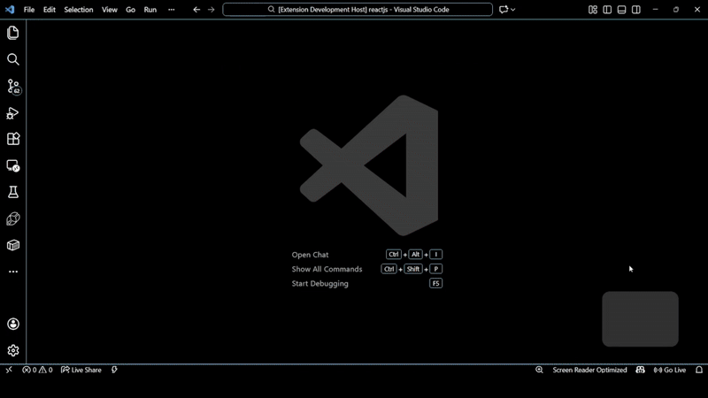
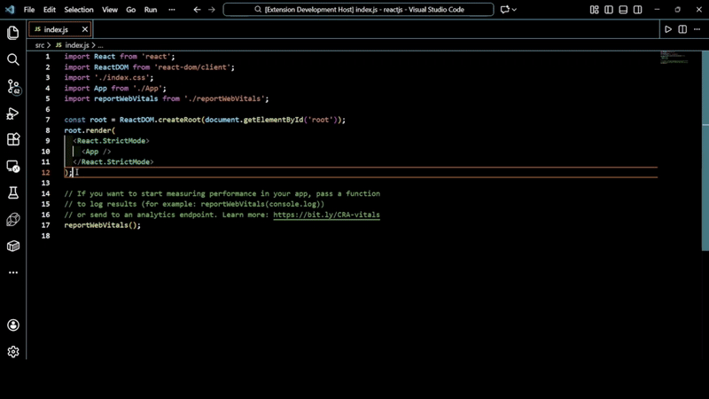
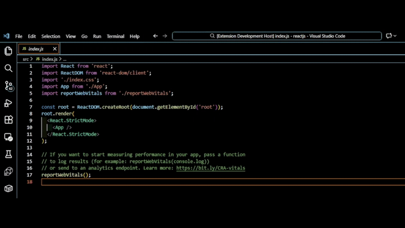
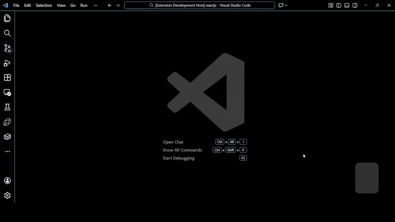
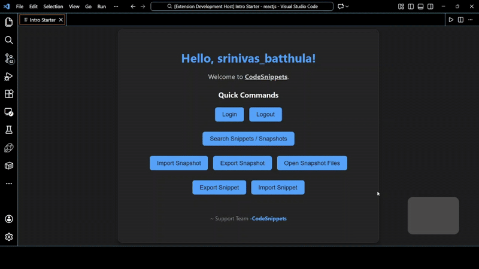
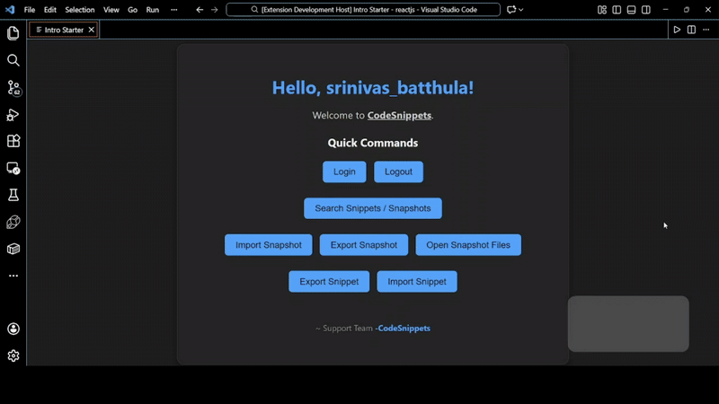
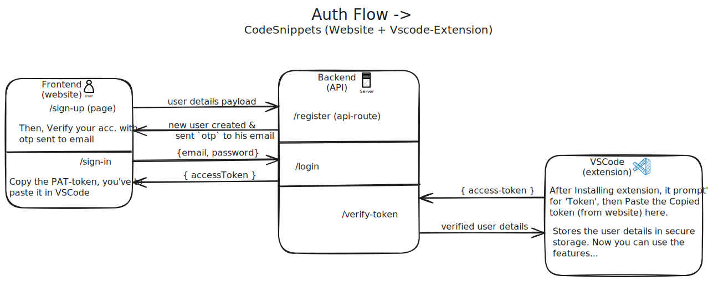

<div id="top" align="center">
    <br>
    <a href="https://github.com/srinivas-batthula/code-snippets-platform#readme">
        
    </a>
    <h1>Snipzen</h1>
    <h3>Sync code snippets & dev setups to cloud</h3>
    <a href="https://marketplace.visualstudio.com/items?itemName=srinivas-batthula.jump-search"></a>
    <a href="https://marketplace.visualstudio.com/items?itemName=srinivas-batthula.jump-search"></a>
    <a href="https://github.com/srinivas-batthula/VSCode-Extension/releases"></a>
</div>

<br>

A productivity platform to import/export/share VS Code snippets & environment snapshots — with cloud sync and web management.

## 🔗 Live Links

- [](https://marketplace.visualstudio.com/items?itemName=srinivas-batthula.jump-search)
- [](https://snipzen.com)

## ✨ Key Features

- **One-Click Snippet Import & Export** — Instantly move VS Code snippets across machines without manual setup

- **VS Code Environment Snapshots** — Capture and restore your complete editor setup in seconds

- **Secure Authentication** — User-scoped, token-based authentication to protect snippets and environments

- **Fast & Reliable Search** — Instantly search snippets and users with low-latency results

- **Web Dashboard Management** — View, organize, and manage snippets from the web

- **Native VSCode Extension** — Seamless, In-editor experience without breaking developer flow

## 🚀 Usage

### 1. Open Menu / Intro panel

#### Through Command Palette

1. Open Command Palette. (<kbd>Ctrl</kbd> + <kbd>Shift</kbd> + <kbd>P</kbd>)
2. Run **"SnipZen: intro"**.
3. You can perform all tasks from this panel.

#### Through Keyboard Shortcut

1. Hit <kbd>Ctrl</kbd> + <kbd>Shift</kbd> + <kbd>M</kbd>  
   ( <kbd>⌘</kbd> + <kbd>⇧</kbd> + <kbd>M</kbd> on macOS )



### 2. Export a code snippet

#### Through Editor Context Menu

1. Select the code in the editor.
2. Right-click and choose **"SnipZen: Export Code Snippet"**.
3. Confirm the export.

#### Through Command Palette

1. Select the code in the editor.
2. Open Command Palette. (<kbd>Ctrl</kbd> + <kbd>Shift</kbd> + <kbd>P</kbd>)
3. Run `SnipZen: Export Code Snippet`.

#### Through Keyboard Shortcut

1. Select the code in the editor.
2. Hit <kbd>Ctrl</kbd> + <kbd>Shift</kbd> + <kbd>E</kbd>  
   ( <kbd>⌘</kbd> + <kbd>⇧</kbd> + <kbd>E</kbd> on macOS )




### 3. Import a code snippet

#### Through Command Palette

1. Open Command Palette.
2. Run `SnipZen: Import Code Snippet`.
3. Enter Snippet-ID to import.

#### Through Keyboard Shortcut

1. Hit <kbd>Ctrl</kbd> + <kbd>Shift</kbd> + <kbd>I</kbd>  
   ( <kbd>⌘</kbd> + <kbd>⇧</kbd> + <kbd>I</kbd> on macOS )
2. Select the snippet to import.



### 4. Export Dev-Environment Snapshot

#### Through Command Palette

1. Open Command Palette.
2. Run `SnipZen: Export Dev-Env Snapshot`.
3. Confirm snapshot export.

#### Through Keyboard Shortcut

1. Hit <kbd>Ctrl</kbd> + <kbd>Shift</kbd> + <kbd>X</kbd>  
   ( <kbd>⌘</kbd> + <kbd>⇧</kbd> + <kbd>X</kbd> on macOS )



### 5. Import Dev-Environment Snapshot

#### Through Command Palette

1. Open Command Palette.
2. Run `SnipZen: Import Dev-Env Snapshot`.
3. Enter Snapshot-ID to import.

#### Through Keyboard Shortcut

1. Hit <kbd>Ctrl</kbd> + <kbd>Shift</kbd> + <kbd>T</kbd>  
   ( <kbd>⌘</kbd> + <kbd>⇧</kbd> + <kbd>T</kbd> on macOS )



### 6. Search for Snippets

#### Through Command Palette

1. Hit <kbd>Ctrl</kbd> + <kbd>Shift</kbd> + <kbd>P</kbd> ( <kbd>⌘</kbd> + <kbd>⇧</kbd> + <kbd>P</kbd> on macOS )
2. Run `SnipZen: Search`.
3. Type your query and press <kbd>Enter</kbd>.

#### Through Keyboard Shortcut

1. Hit <kbd>Ctrl</kbd> + <kbd>Shift</kbd> + <kbd>S</kbd>  
   ( <kbd>⌘</kbd> + <kbd>⇧</kbd> + <kbd>S</kbd> on macOS )
2. Type your query and press <kbd>Enter</kbd>.




## 🧬 Feature Workflows

<details>
<summary><strong>▶️ View Feature Workflows (Architecture Diagrams)</strong></summary>
<br>

#### 1. Auth Feature Workflow

<p align="center">
  <a href="https://raw.githubusercontent.com/srinivas-batthula/code-snippets-platform/refs/heads/main/assets/features/authFlow_codesnippets.svg" target="_blank">
    
  </a>
</p>

---

#### 2. Snippets Feature Workflow

<p align="center">
  <a href="https://raw.githubusercontent.com/srinivas-batthula/code-snippets-platform/refs/heads/main/assets/features/snippetsFlow_codesnippets.svg" target="_blank">
    
  </a>
</p>

---

#### 3. Search Feature Workflow

<p align="center">
  <a href="https://raw.githubusercontent.com/srinivas-batthula/code-snippets-platform/refs/heads/main/assets/features/searchFlow_codesnippets.svg" target="_blank">
    
  </a>
</p>

</details>

## 🌍 Real-World Use Cases

- **For Teams:** Instantly spin up a full development environment and share setups with teammates
- **For Individual Developers:** Sync personal snippets and dev environments across multiple machines effortlessly
- **For Students & Communities:** Distribute ready-to-use VS Code setups for courses, workshops, and learning groups
- **For Freelancers & Consultants:** Maintain and switch between multiple client-specific VS Code setups easily

## 🛠️ Tech Stack

- **Web:** Next.js, Tailwind CSS, Next-Auth, Redis
- **Extension:** TypeScript, vscode-engine
- **Database:** MongoDB Atlas + Mongoose ODM
- **API Docs:** Swagger Docs
- **Deployment:** Vercel, VSCode Marketplace, GitHub-Actions(CI/CD)

## 🗂️ Project Structure

```
snipzen/
├── .github/workflows/
├── assets/
├── web/
│ ├── public/
│ └── src/
│   ├── components/
│   ├── models/
│   ├── schemas/
│   ├── types/
│   ├── styles/
│   ├── hooks/
│   ├── lib/
│   └── app/
│     ├── api/
│     └── (pages)/
│
├── extension/
│ └── src/
│   ├── out/
│   ├── commands/
│   ├── panels/
│   └── utils/
├── install.sh
└── Readme.md
```

## 🤝 Setup / Installation & Contribute

- Visit [CONTRIBUTING.md](./CONTRIBUTING.md)

## 📄 License

This project is licensed under the MIT License - see the
[LICENSE](./LICENSE) file for details.

## 📬 Contact / Support

- [](https://srinivas-batthula.me) [](mailto:srinivasbatthula05.official@gmail.com)

- [](https://himanshubijja.me) [](mailto:himanshubijja.official@gmail.com)

## 👥 Contributors

- **Srinivas Batthula [@srinivas-batthula](https://github.com/srinivas-batthula)**
- **Himanshu Bijja [@himanshubijja](https://github.com/himanshubijja)**
