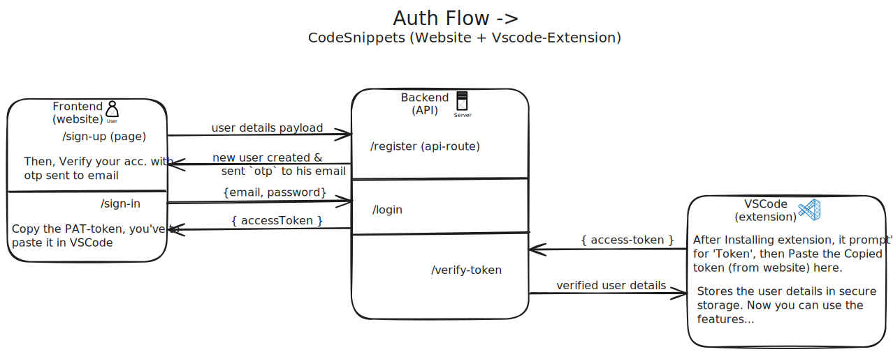
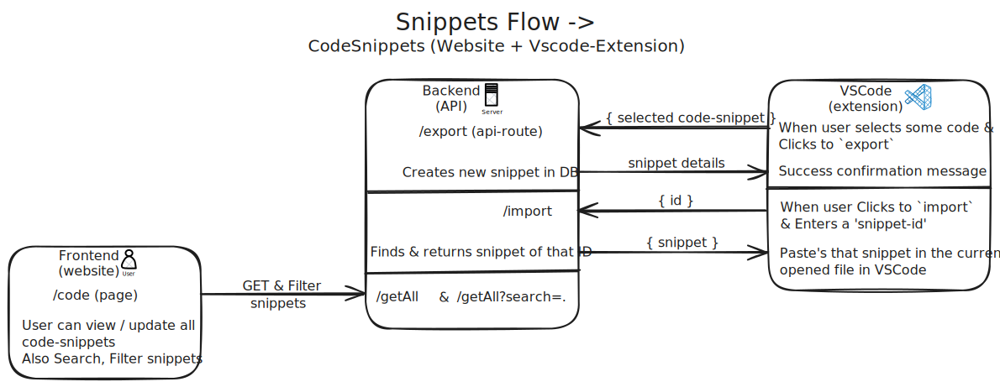
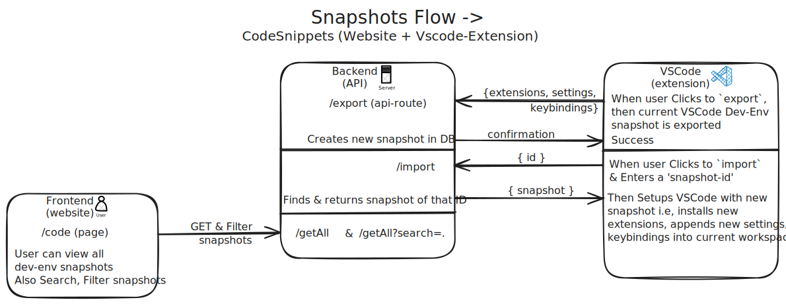
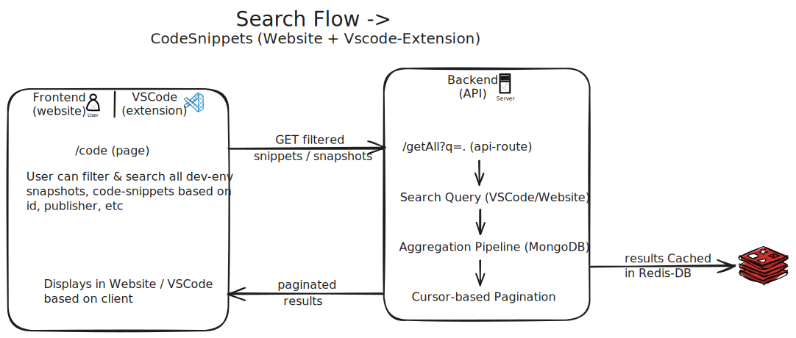

# code-snippets-platform

## 🔁 Feature Workflows

  <h2><a href="https://raw.githubusercontent.com/srinivas-batthula/code-snippets-platform/refs/heads/main/assets/authFlow_codesnippets.svg" target="_blank" rel="noopener noreferrer">1. Auth Feature Workflow</a></h2>
  

  <h2><a href="https://raw.githubusercontent.com/srinivas-batthula/code-snippets-platform/refs/heads/main/assets/snippetsFlow_codesnippets.svg" target="_blank" rel="noopener noreferrer">2. Snippets Feature Workflow</a></h2>
  

  <h2><a href="https://raw.githubusercontent.com/srinivas-batthula/code-snippets-platform/refs/heads/main/assets/snapshotsFlow_codesnippets.svg" target="_blank" rel="noopener noreferrer">3. Snapshots Feature Workflow</a></h2>
  

  <h2><a href="https://raw.githubusercontent.com/srinivas-batthula/code-snippets-platform/refs/heads/main/assets/searchFlow_codesnippets.svg" target="_blank" rel="noopener noreferrer">4. Search Feature Workflow</a></h2>
  

## Features Implementaion Flow ->

**1. Implement Auth**

**2. Snippets management**

**3. Snapshots management**

**4. Profile & Dashboard**

**5. Search (snippets & snapshots) management**
